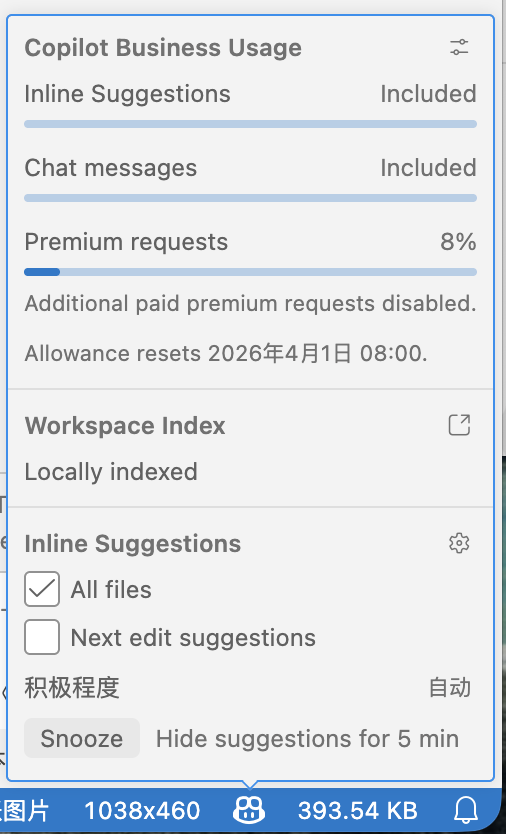
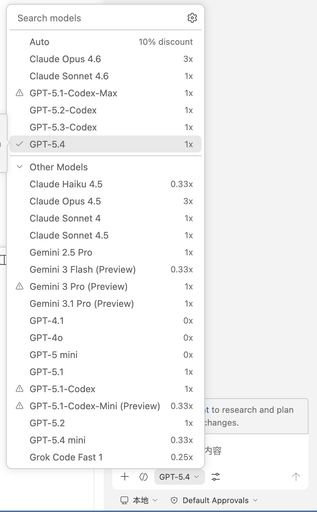
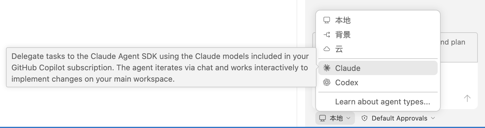

# 齐鲁工业大学 Adam 战队 GitHub Copilot 订阅席位组织

**本组织 GitHub Copilot Business 订阅席位由山东鹏云信息科技有限公司赞助**

本组织专用于提供订阅席位，不建议将生产资料上传至本组织！

### 简要使用指南

1. 申请加入本组织，等待管理员批准。
2. 加入后，前往你喜欢的 IDE/编辑器，安装 GitHub Copilot 插件（下面以 VS Code 为例）。
3. 在 VS Code 中，登陆你加入本组织的 GitHub 账号，确保你已经获得了 Copilot 的订阅席位。
4. 点击 Copilot 插件徽标，查看你的订阅状态和使用情况。

5. 点击 Chat 标签，进入 Copilot Chat 界面，使用互动式编程。
6. 你可以切换至你喜欢的模型，通常场景建议使用 GPT-5.4 / GPT-5.3-Codex / Claude Sonnet 4.6 模型，高难度场景考虑使用 Claude Opus 4.6 模型。

7. 你可以从本地 Copilot Agent 切换到由 Claude 或 Codex 提供的 Agent

